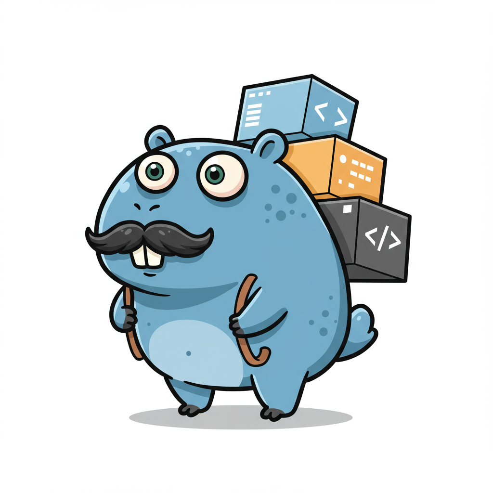

# DWUI: Docker Web UI

<p align="center">
  
</p>

DWUI is a simple web interface for Docker that gives you a "Docker Desktop" like experience, right on your server. It's designed to be lightweight, easy to use, and a perfect companion for deployment tools like [Kamal](https://kamal-deploy.org/).

Born out of a need for a no-fuss container management tool, DWUI aims to be simple, effective, and open to the community.

## In Action

<p align="center">
  
</p>

## Features

- **View Containers**: See all your running containers and their status at a glance.
- **Inspect Details**: Check environment variables and open ports.
- **Real-time Logs**: Stream container logs directly in your browser.
- **Web Terminal**: Open an interactive terminal into your containers.
- **Single Binary**: No dependencies or complex setup. Just one file to run.
- **Kamal-Friendly**: A great companion to your Kamal deployment workflow.
- **Responsive**: Access it from your desktop or on the go from your phone.

## Run without Installing

You can run DWUI without a persistent installation using a single command. This will download the correct binary for your system (macOS or Linux), make it executable, and run it.

Make sure to replace `your-very-secure-password` with a strong password.

```bash
curl -sSL https://raw.githubusercontent.com/romerramos/dwui/main/dist/run.sh | bash -s -- --password your-very-secure-password
```

You can also specify a custom port or version:

```bash
# Run on port 9000
curl -sSL https://raw.githubusercontent.com/romerramos/dwui/main/dist/run.sh | bash -s -- --password your-very-secure-password --port 9000

# Run a specific version
curl -sSL https://raw.githubusercontent.com/romerramos/dwui/main/dist/run.sh | bash -s -- --password your-very-secure-password --version v0.0.2
```

## Installation

You can install DWUI as a systemd service on your Linux server with a single command. This will download the binary, set it up to run as a service, and start it automatically.

Make sure to replace `your-very-secure-password` with a strong password of your choice.

```bash
curl -sSL https://raw.githubusercontent.com/romerramos/dwui/main/dist/install.sh | sudo bash -s -- --password your-very-secure-password
```

You can also specify a custom port or version:

```bash
# Install on a custom port (e.g., 9000)
curl -sSL https://raw.githubusercontent.com/romerramos/dwui/main/dist/install.sh | sudo bash -s -- --password your-very-secure-password --port 9000

# Install a specific version
curl -sSL https://raw.githubusercontent.com/romerramos/dwui/main/dist/install.sh | sudo bash -s -- --password your-very-secure-password --version v0.0.2
```

The server will be available at `http://<your-server-ip>:<port>`.

### Uninstallation

To remove DWUI and the associated service from your server, you can use the uninstallation script:

```bash
curl -sSL https://raw.githubusercontent.com/romerramos/dwui/main/dist/uninstall.sh | sudo bash
```

## Development

To run the project in a development environment, you'll need two separate terminal sessions:

1.  **Run the Go backend with live-reloading:**

    ```bash
    air
    ```

2.  **Run the TailwindCSS compiler in watch mode:**
    ```bash
    npx @tailwindcss/cli -i ./tailwind.css -o ./assets/stylesheets/output.css --watch
    ```

## Building from Source

To build the binaries from source, you'll need Go and Make installed on your system. You can build for all supported platforms with a single command:

```bash
make build-all
```

This will place all the binaries in the `./dist` directory. You can also build for a specific platform:

```bash
# Build for Mac (Apple Silicon)
make mac-arm64

# Build for Linux (amd64)
make linux-amd64

# Build for Windows (amd64)
make windows-amd64
```

## Contributing

This project was built to solve a personal need and as a Go learning experience. Contributions, feedback, and suggestions from the community are highly welcome! Feel free to open an issue or a pull request.

## License

This project is licensed under the AGPL v3.0 license. See the [LICENSE](LICENSE) file for more details.

Copyright (C) 2025 Romer Ramos
